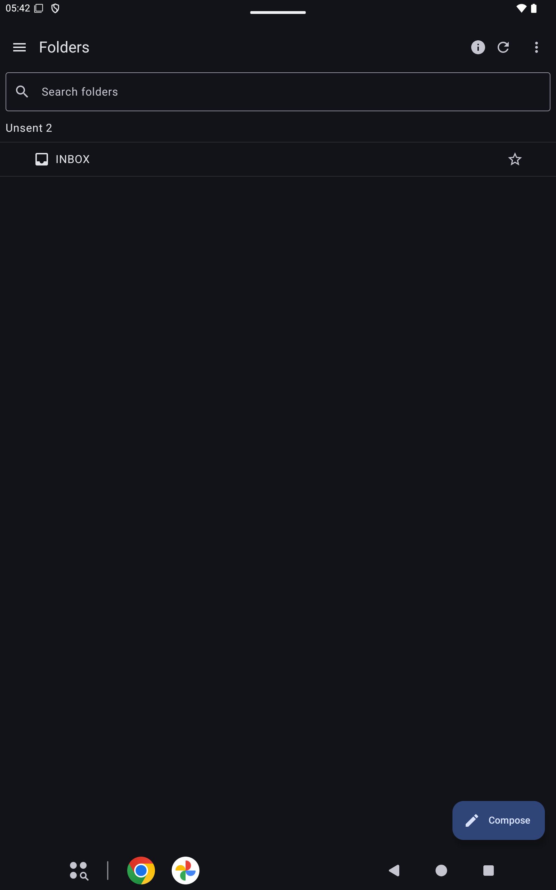

# Folders

The folder list is the first screen after an account is open. INBOX is first. Search folders narrows the list. Unsent is mail that has not left this phone.

## Menu

Menu opens the account list. Each account has its own Inbox, postponed mail, All folders, and favorites. Opening an Inbox checks that account. Each account keeps its own connection.

## Refresh

Refresh loads the folder list again.

## More

More holds Collapse all, Save as default view, Reset to default view, and Customize toolbar.

## Compose

Compose starts a new message.
