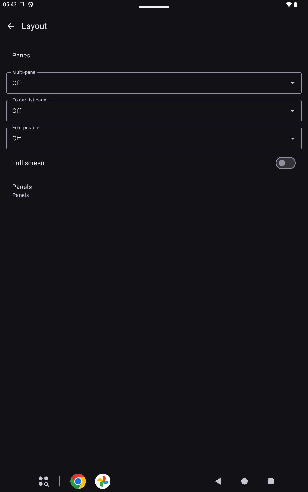

# Layout

Settings, Layout holds the pane choices. Each stays off until you turn it on. Window width does not turn a pane on.

## Multi-pane

Multi-pane shows the message beside the message list.

## Folder list pane

When Folder list pane is on, the folder list stays beside an open index or message.

## Fold posture

When Fold posture is on and the device reports a horizontal hinge, the panes stack. No hinge leaves them side by side.

## Full screen

Full screen hides the status bar and the navigation bar. A swipe shows them again.

## Panels

Panels opens the toolbar editors for the folder list, the message list, a selection, the reader, and compose.
