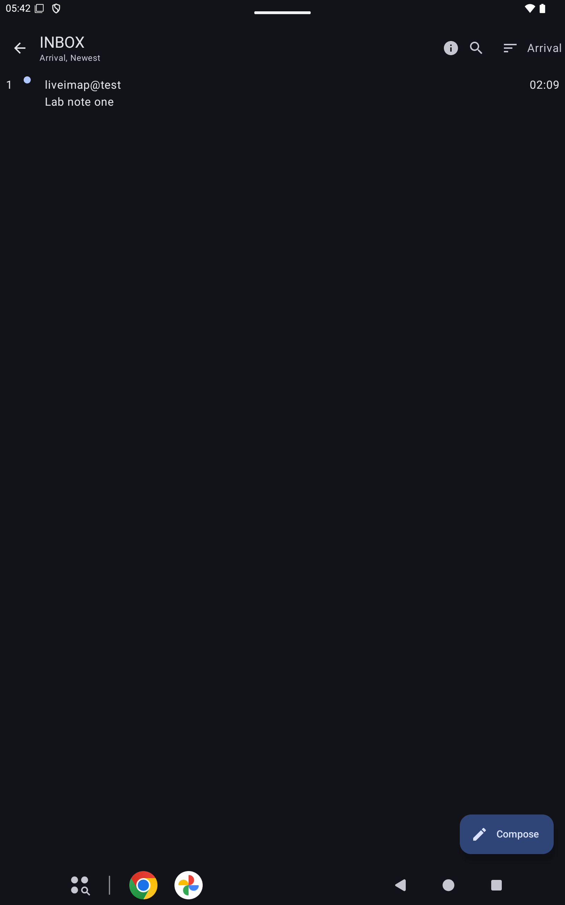

# Messages

Open a folder to see its messages. The title is the folder name. The line under it is the sort, such as Arrival, Newest.

## Back

Back returns to the folder list.

## Search

Search searches this folder. Subject is the usual field. Full text is a separate, slower search.

## Sort

Sort changes the order of this folder. The choice lasts until you leave the app. The usual sort for the folder is under Settings, Folders. The Sort menu also holds Expunge, Select all, Folder info, Jump to number, Next unread, Mark all read, and Customize toolbar.

## Filter

Filter shows one kind of message, such as new or deleted.

## Refresh

Refresh loads this folder again.

## More

When messages are selected, More holds the rest of the selection actions.

## Compose

Compose starts a new message.
