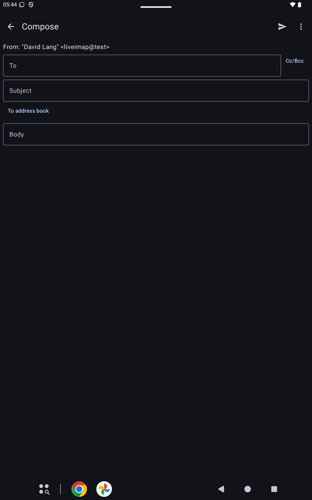

# Writing

Compose starts a new message. Reply, Reply all, and Forward start from the open message.

## Send

Send sends the message. Settings, Sending, sets the wrap column and flowed text. Settings, Import, Export .pinerc writes a .pinerc from this account's settings and leaves passwords out.

## Postpone

Postpone saves the message to send later.

## Back

Back leaves the message. A message you have started asks before it is discarded.

## More

More holds the rest of the compose actions, including Customize toolbar.

Cc/Bcc shows the copy fields. To address book picks an address from the address book.
